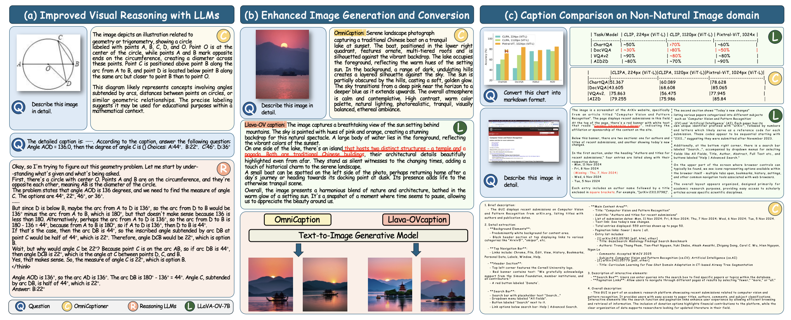
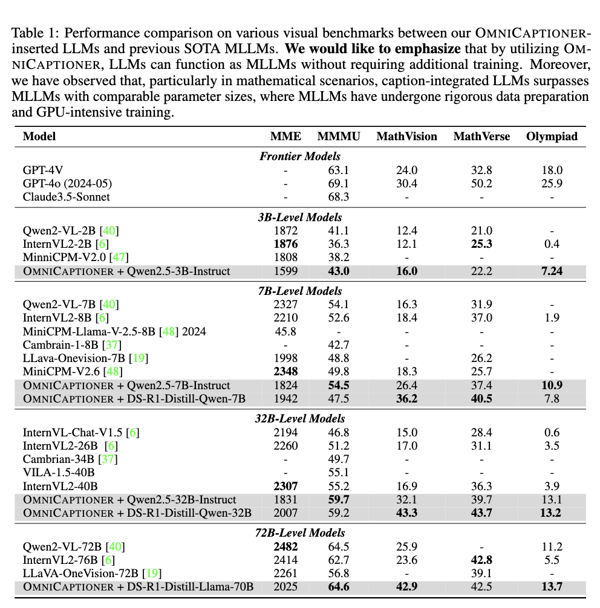

<div align="center">
<h1> OmniCaptioner: One Captioner to Rule Them All </h1>

</div>
<div align="center">

<p align="center">
💜 <a href="https://alpha-innovator.github.io/OmniCaptioner-project-page/"><b>HomePage</b></a>&nbsp&nbsp | &nbsp&nbsp🤗 <a href="https://huggingface.co/U4R/OmniCaptioner">Hugging Face</a>&nbsp&nbsp | &nbsp&nbsp📑 <a href="https://arxiv.org/abs">Paper</a>&nbsp&nbsp
</p>
</div>


## 📰 News

We propose OmniCaptioner, a versatile visual captioning framework for generating fine-grained textual descriptions across a wide variety of visual domains. Unlike prior methods limited to specific image types (e.g., natural images or geometric visuals), our framework provides a unified solution for captioning natural images, visual text (e.g., posters, UIs, textbooks), and structured visuals (e.g., documents, tables, charts). By converting low-level pixel information into semantically rich textual representations, our framework bridges the gap between visual and textual modalities. Our results highlight three key advantages: (i) Enhanced Visual Reasoning with LLMs, where long-context captions of visual modalities empower LLMs, particularly the DeepSeek-R1 series, to reason effectively in multimodal scenarios; (ii) Improved Image Generation, where detailed captions improve tasks like text-to-image generation and image transformation; and (iii) Efficient Supervised Fine-Tuning (SFT), which enables faster convergence with less data. We believe the versatility and adaptability of OmniCaptioner can offer a new perspective for bridging the gap between language and visual modalities.




## 📊 Quantatitive Performance



## 💻 Finetuning Code
### 1. Create a conda environment and install PyTorch
```bash
conda create -n OmniCap python=3.9
conda activate OmniCap
```
### 2.Install dependencies
```bash
pip install -r requirements.txt
```
### 3. Install flash-attn
```bash
pip install flash-attn --no-build-isolation
```
### 4. Prepare data
You can place the links to your data files in `./data/caption_data.yaml`.

### 5. Start finetuning
```bash
bash scripts/finetune_caption_slurm.sh
```
## 🚀 Inference Code

You can caption the image with AIGC style using the following command:


```python   
CUDA_VISIBLE_DEVICES=0 python src/inference_single_image.py \
    --model_path your_model_path \
    --image_path your_image_path  \
    --image_type aigc 
``` 

You can caption the image with OCR style using the following command:

```python   
CUDA_VISIBLE_DEVICES=0 python src/inference_single_image.py \
    --model_path your_model_path \
    --image_path your_image_path  \
    --image_type ocr 
``` 
## 🚀 Evaluation Code with LLM

```python   

cd VLMEvalkit
conda create -n VLMEvalkit python=3.9
conda activate VLMEvalkit
pip install -e .

CUDA_VISIBLE_DEVICES=0  nohup python run.py --data MMMU_DEV_VAL --model Omnicaptioner-qwen2-5-3B --verbose > output_omnicap_qwen2-5-3B_MMMU_DEV_VAL.log 2>&1 &
CUDA_VISIBLE_DEVICES=0,1  nohup python run.py --data MMMU_DEV_VAL --model Omnicaptioner-qwen2-5-7B --verbose > output_omnicap_qwen2-5-7B_MMMU_DEV_VAL.log 2>&1 &
CUDA_VISIBLE_DEVICES=0,1,2,3  nohup python run.py --data MMMU_DEV_VAL --model Omnicaptioner-qwen2-5-32B --verbose > output_omnicap_qwen2-5-32B_MMMU_DEV_VAL.log 2>&1 &

CUDA_VISIBLE_DEVICES=0  nohup python run.py --data MMMU_DEV_VAL --model Omnicaptioner-deepseek-distill-7B --verbose > output_omnicap_deepseek_distill_3B_MMMU_DEV_VAL.log 2>&1 &
CUDA_VISIBLE_DEVICES=0,1  nohup python run.py --data MMMU_DEV_VAL --model Omnicaptioner-deepseek-distill-32B --verbose > output_omnicap_deepseek_distill_32B_MMMU_DEV_VAL.log 2>&1 &
CUDA_VISIBLE_DEVICES=0,1,2,3  nohup python run.py --data MMMU_DEV_VAL --model Omnicaptioner-deepseek-distill-70B --verbose > output_omnicap_deepseek_distill_70B_MMMU_DEV_VAL.log 2>&1 &

``` 


## Citation

If you find the provided code or models useful for your research, consider citing them as:
```

```


